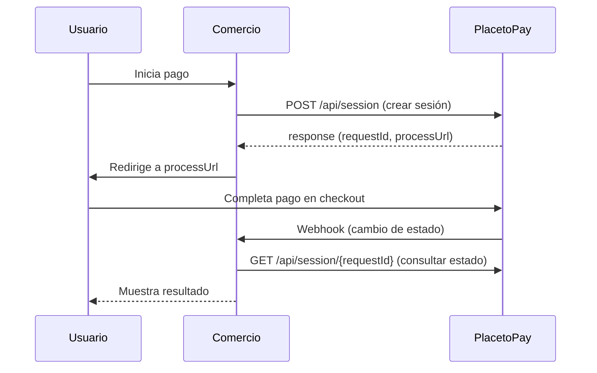

# 🏷️ Pago Único

> [!IMPORTANT] Requisito: Autenticación
> Para utilizar **cualquier producto** de PlacetoPay (Pago Único, Suscripción, Preautorización, Dispersión, etc.) es **obligatorio** autenticarse primero con las credenciales **Login** y **SecretKey**.
> → [[Autenticación|Ver documentación completa de Autenticación]]

El flujo más simple de los servicios de PlacetoPay. Inicia con la **creación de sesión** y consume el `getRequestInformation` para traer la información del pago.

> **Lightbox:** Existe una modalidad especial llamada [[PRODUCTOS/Pago Único/Lightbox\|Lightbox]] que permite al usuario pagar sin salir del sitio del comercio.
>
> **Pago On click:** Variante con tarjeta guardada (wallet) — [[PRODUCTOS/PAGO ONCLICK/Pago On click\|Pago On click]].

---

## 📋 Flujo Básico



---

## 🔐 Autenticación

Para transaccionar necesitas credenciales **Login** y **SecretKey**.

> 🡒 Ver [[Autenticación]] para el detalle completo del esquema de autenticación.

---

## 📦 Payload de Ejemplo

### Endpoint (TEST)
```
POST https://checkout-test.placetopay.ec/api/session
```

```json
{
  "locale": "es_EC",
  "buyer": {
    "name": "Diego",
    "surname": "Rivas",
    "email": "diego.rivas@ppm.com.ec",
    "document": "1111111111",
    "documentType": "CI",
    "mobile": "+593998709349"
  },
  "payment": {
    "reference": "REF-PAGO-UNICO",
    "description": "Testing Payment",
    "amount": {
      "currency": "USD",
      "total": 4
    }
  },
  "expiration": "2026-07-23T13:48:42.376Z",
  "returnUrl": "https://p2p-apis.pages.dev/apis/checkout",
  "ipAddress": "127.0.0.1",
  "userAgent": "Mozilla/5.0 (Macintosh; Intel Mac OS X 10_15_7) ...",
  "metadata": []
}
```

### Consulta de Pago
```
GET https://checkout-test.placetopay.ec/api/session/{requestId}
```

---

## 📖 Campos del Payload

### `buyer`
Datos del comprador. Dependiendo del comercio se puede exceptuar el envío de algunos campos.

### `payment.items`
Permite que el checkout detalle lo que se compra como un **carrito de compras**.

### `payment.paymentMethod`
Fuerza el medio de pago (ej: `ID_VS` para Interdin Visa, `MT_VS` para Mastercard, `DF_VS` para Datafast). Los códigos varían según el país.

> Consultar la [documentación oficial](https://docs.placetopay.dev/) para códigos por país.

### `payment.taxes` (Impuestos)
Se pueden enviar impuestos: envío, propina, IVA, ICE, tasa aeroportuaria.
> 📖 [Documentación de impuestos](https://docs.placetopay.dev/checkout/tax-details/#amount-taxes)

### `fields` (Campos adicionales)
Si el comercio desea enviar más datos, hasta **50 campos adicionales**.
> 📖 [Documentación de campos adicionales](https://docs.placetopay.dev/checkout/additional-fields/)

### `skipResult`
- **Pago básico**: opcional
- **Suscripción**: obligatorio

### `type`
Para transacciones especiales:
- `checkin` → Preautorizaciones
- `autopay` → Recurrencia (no aplica en Ecuador para Pago Único)

### `expiration`
Tiempo de expiración de la sesión. El cliente debe completar el pago antes de esta fecha.

### `ipAddress` y `userAgent`
Valores de confidencialidad. La pasarela los vincula a la transacción y al dispositivo del usuario.

### `metadata`
En piloto. No se recomienda usar sin validar con Colombia. Ejemplo: `initiatorIndicator` (Agent, Cardholder, etc.).
> 📖 [Documentación de metadata](https://docs.placetopay.dev/checkout/metadata/)

### `returnUrl`
URL a la que el usuario será redirigido después del pago. Es importante capturar los parámetros de retorno para identificar el resultado de la transacción.

---

## 🔗 Webhook

El [[General/Webhook|Webhook]] notifica al backend del comercio cuando cambia el estado de la transacción.

**Configuración:** Enviar `notificationUrl` en el payload de creación de sesión.

> 🡒 Ver [[General/Webhook]] para el detalle completo del proceso.

---

## 🔄 Sonda

La [[General/Sonda|Sonda]] es un barrido periódico de todas las transacciones del día. Las que estén en estado `PENDING` se consultan mediante `getRequestInformation` para obtener el estado final y actualizar la base de datos local.

> 🡒 Ver [[General/Sonda]] para el detalle completo del proceso.

---

## ℹ️ Notas Adicionales

- **Múltiples intentos de pago**: Siempre se toma el estado final de la sesión.
- **Kount**: Motor de riesgo que valida el dispositivo del usuario (fingerprint). Usa Marathon.
- **Seed**: No debe tener una diferencia mayor a **5 minutos**.
- **DNITEX (Pruebas)**: [https://p2p-apis.pages.dev/apis/checkout?tab=general](https://p2p-apis.pages.dev/apis/checkout?tab=general)


## ℹ️ Checklist_ 2026

[[Checklist_WC_pago_basico_2026.pdf| Ver Checklist]]
