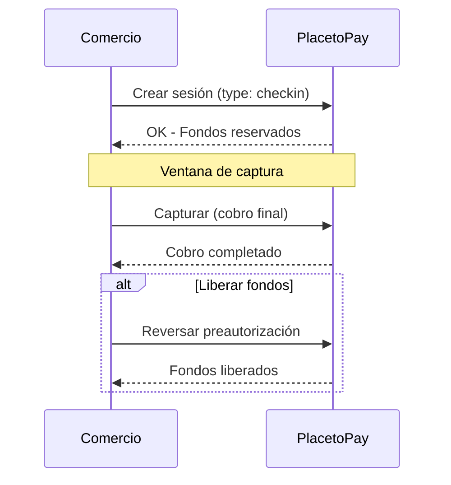

# 🔒 Preautorización — Reserva de Fondos

> [!IMPORTANT] Requisito: Autenticación
> Para realizar preautorizaciones es **obligatorio** autenticarse con **Login** y **SecretKey**.
> → [[Autenticación|Ver documentación completa de Autenticación]]

La **Preautorización** permite reservar fondos en la tarjeta del usuario sin cobrarlos inmediatamente. El cobro se completa posteriormente (captura) o se libera (reverso).

> **Relacionado:** [[PRODUCTOS/Suscripción/Suscripción|Suscripción]], [[PRODUCTOS/Acciones y Consultas/Reembolso|Reembolso]], [[PRODUCTOS/Acciones y Consultas/Reverso|Reverso]], [[PRODUCTOS/PREAUTORIZACIONES/Reautorizaciones|Reautorizaciones]]

---

## 📋 Flujo de Preautorización



---

## 🔑 Tokenización en Preautorizaciones

> **¿Hay tokenización en preautorizaciones?**  
> Sí, se puede tokenizar la tarjeta durante una preautorización para usos futuros.

Esto permite:
1. Preautorizar la tarjeta (reservar fondos)
2. Tokenizarla para futuros cobros
3. Capturar el monto final cuando corresponda

---

## ⚙️ Configuración

En el payload de creación de sesión, usar:

```json
{
  "type": "checkin",
  "payment": {
    "reference": "REF-PREAUT",
    "description": "Preautorización de prueba",
    "amount": {
      "currency": "USD",
      "total": 100.00
    }
  }
}
```

> **Nota:** El campo `type` debe ser `checkin` para preautorizaciones.

---

## Acciones Relacionadas

| Acción | Descripción | Enlace |
|--------|-------------|--------|
| **Captura** | Completar el cobro de la preautorización | — |
| **Reverso** | Liberar los fondos reservados | [[PRODUCTOS/Acciones y Consultas/Reverso\|Reverso]] |
| **Cancelación** | Cancelar la sesión antes del vencimiento | [[PRODUCTOS/Acciones y Consultas/Cancelación de Sesión\|Cancelación]] |
| **Reautorización** | Incrementar o liberar el monto reservado | [[PRODUCTOS/PREAUTORIZACIONES/Reautorizaciones\|Reautorizaciones]] |
