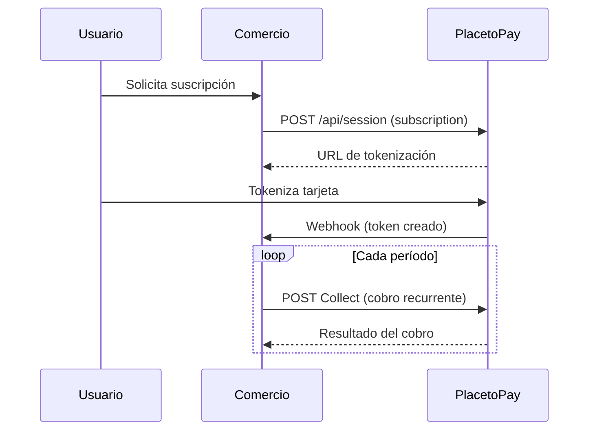

# 🔄 Suscripción — Pagos Recurrentes

> [!IMPORTANT] Requisito: Autenticación
> La autenticación con **Login** y **SecretKey** es obligatoria para crear sesiones de suscripción y ejecutar cobros (Collects).
> → [[Autenticación|Ver documentación completa de Autenticación]]

La suscripción permite crear una **tokenización de la tarjeta** del usuario y, con ese token, realizar cobros recurrentes (**Collects**).

> **Importante:** Al crear la tokenización, el campo **BIN** no viene en la respuesta inicial. El BIN se obtiene cuando se realiza el cobro (Collect).

---

## 📋 Flujo de Suscripción



---

## 📦 Payload Inicial

```json
{
  "locale": "es_EC",
  "buyer": {
    "name": "Diego",
    "surname": "Rivas",
    "email": "diego.rivas@ppm.com.ec",
    "document": "1111111111",
    "documentType": "CI",
    "mobile": "+573111111111"
  },
  "subscription": {
    "reference": "SUB-Producto-Ejm",
    "description": "Testing Subscription"
  },
  "expiration": "2026-07-23T15:40:33.804Z",
  "returnUrl": "https://p2p-apis.pages.dev/apis/checkout",
  "ipAddress": "127.0.0.1",
  "userAgent": "Mozilla/5.0 (Macintosh; Intel Mac OS X 10_15_7) ...",
  "metadata": []
}
```

---

## 💳 Proceso de Cobro (Collects)

- Los **Collects** los maneja el **comercio**
- El comercio define la **periodicidad** de los cobros
- Es una **concurrencia hacia la suscripción**: la tarjeta se convierte en un token y este es la llave para las transacciones
- **Merchant-initiated**: Quien inicia la solicitud es el usuario en el comercio

---

## 🔐 3DS en Suscripción

- **3DS** se evalúa solo en la **primera transacción** (tokenización)
- Una vez tokenizada la tarjeta, los cobros subsecuentes (Collects) quedan cubiertos
- "El 3DS como es el flujo" es un valor adicional y no una responsabilidad a futuro

---

## 💵 Verificación de Tarjeta

- Se realiza una verificación de **$1 USD** para confirmar que el usuario es quien dice ser
- Existen dos tipos de transacciones:
  - **PA (Payment Amount)**: Atadas a un monto específico
  - **NPA (No Payment Amount)**: Sin monto asociado, solo validación

---

## 🖱️ Pago OnClick

Flujo similar a **Rappi**, **wallet de PlacetoPay** o **Amazon**:

1. Registrar al usuario
2. Almacenar la información de la tarjeta ("guardar tarjeta")
3. Queda almacenada para 2do, 3er, ... cobro

---

## 🔗 Webhook

El [[General/Webhook|Webhook]] en suscripción notifica:
- Creación del token (tokenización exitosa)
- Resultado de cada Collect (cobro recurrente)
- Cambios de estado en la suscripción

> 🡒 Ver [[General/Webhook]] para el detalle completo del proceso.

---

## 🔄 Sonda

La [[General/Sonda|Sonda]] en suscripción:
- Revisa suscripciones y cobros en estado `PENDING`
- Consulta el estado actual mediante la API
- Actualiza los registros locales

> 🡒 Ver [[General/Sonda]] para el detalle completo del proceso.

---

## 📚 Subproductos

| Producto | Descripción | Enlace |
|----------|-------------|--------|
| **Diferido** | Pagos diferidos en suscripciones (cuotas) | [[PRODUCTOS/Suscripción/Diferido\|Ver más]] |
| **Preautorización** | Reserva de fondos antes del cobro final | [[PRODUCTOS/Suscripción/Preautorización\|Ver más]] |

---

## ❓ Preguntas Frecuentes

**¿Hay tokenización en preautorizaciones?**
Sí, se puede tokenizar.

**¿Qué redes permiten suscripción diferida?**
*Pendiente de especificar.*

**¿El 3DS cómo funciona en suscripción?**
Solo funciona en la tokenización inicial. El inicio del flujo queda cubierto.
